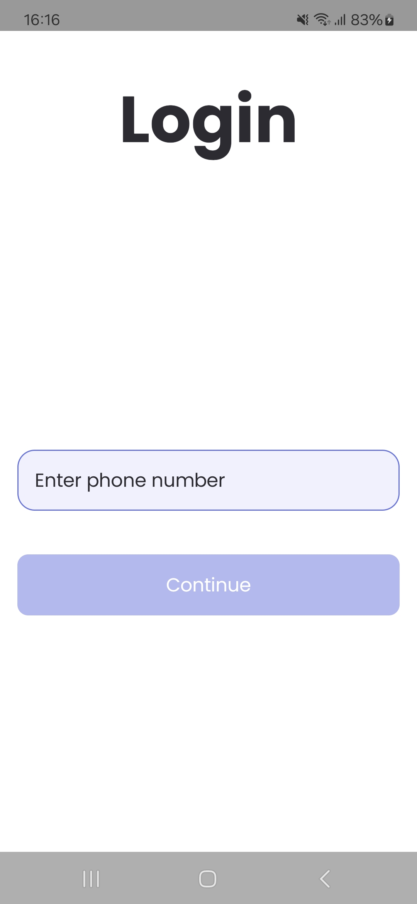
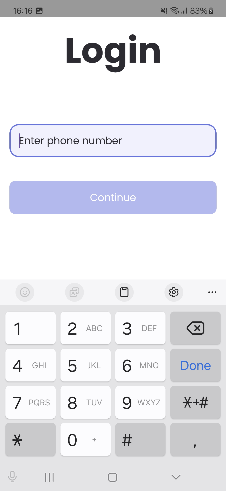
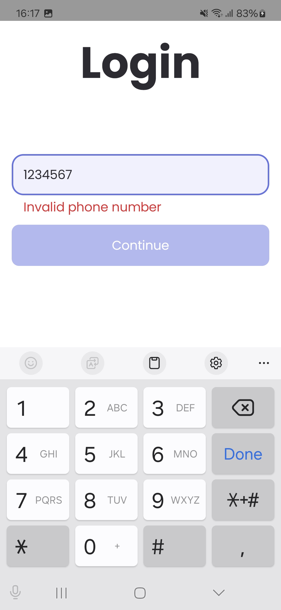

# Introduction

In this workshop, we will explore how to effectively use the Compose Base Project Setup to rapidly
build and scale Android applications. The goal is to help developers understand the streamlined
process of adding new features, handling user inputs, making API calls, and communicating between
screens, all while adhering to best practices.

We'll begin by creating a simple login screen to introduce basic concepts like handling user inputs
and processing data. Next, we’ll move to a partially built screen, where you will focus on
integrating API calls and presenting the data in the UI. Lastly, you'll learn how to get result back from the another screen.

By the end of this workshop, you will have a hands-on understanding of:

* Adding new screens/features
* Managing user input and data processing
* Making API calls and displaying results on the UI
* Retrieving data from another screen
* Following best practices for a clean and scalable codebase

# Build

1. Create Arkana env files at root level using below command
    ```bash
    touch .env .env.dev .env.qa .env.prod
    ```
2. Add `ProductsEndPoint` with value `https://api.escuelajs.co/api/v1/` in the env files
3. Generate Arkana using below command
    ```bash
   ./genArkana dev
    ```

# Step 1 - Creating a structure

Here you'll learn to add a new screen, utilise the `design` components and structuring the feature.

1. Create a feature directory named `onboarding` under `ui` where we can put everything related to onboarding a user.
2. Lets create a `navigation` directory under `onboarding` to keep our navigation related files.
3. Create `OnboardingDestination.kt` and define route and destination.
4. Create `OnboardingNavigation.kt` to create navigation graph of the onboarding. All the composables for specified onboarding destinations will be hosted in this file.

# Step 2 - Login screen

Here you'll learn to create a screen using components provided by `design` module.

1. Create a directory named `login` under `onboarding` directory to keep everything related to login at one place.
2. Lets create some empty files first which are mostly always required in any screen.
    * `LoginScreen.kt`
    * `LoginUiState.kt`
    * `LoginViewModel.kt`
3. As per the guideline [State should be hoisted](https://simformsolutionspvtltd.sharepoint.com/sites/android30/SitePages/Jetpack-Compose-Guidelines.aspx#state-should-be-hoisted) and [Compose components structuring](https://simformsolutionspvtltd.sharepoint.com/sites/android30/SitePages/Jetpack-Compose-Guidelines.aspx#compose-components-structuring) you can now create the screen shown in the screenshots.

#### Components to use

* `ScreenTitle` to show "Login" title
* `AppOutlinedTextField` for taking phone number input
* `AppButton` for "Continue" button and `AppText` for showing a text
* app level `strings.xml` for string resources

#### Screenshots:





# Step 3 - Validating user input

Here you'll learn to validate phone number and enable/disable the continue button based on a valid input. Additionally you can show error message below the text field.

1. Identify required data to be hosted in a `LoginUiState` state.
2. Identify the approach how you can validate the input.
3. Add required functions in `LoginViewModel`.
4. Uncomment code at `MainScreen.kt`

# Step 4 - Moving to Products Screen

Here you'll learn to move to a another screen when Continue button is clicked from a ViewModel.

Once you get a callback at `LoginViewModel` what you need to do is utilise `Navigator` to navigate to `Products` destination.

# Step 5 - Add Repository

Here you'll learn to make an API call using Retrofit service and repository pattern.

1. Create a `product` directory under `repository` directory to place our repositories related to product.
2. Create `ProductRepository` and `ProductRepositoryImpl` which implements `ProductRepository`.
3. Implement repository using `ProductService` to make an API call.
4. Use `RepositoryModule.kt` to bind the `ProductRepositoryImpl` with `ProductRepository` to be able to inject `ProductRepository`.
5. Add `ProductRepository` in the constructor of the `ProductsViewModel`.

# Step 6 - Showing Products listing

Here you'll learn to show the progress indicator and products list fetched from an API call.

1. Complete the `fetchProducts` function at `ProductsViewModel` using `ProductRepository` 
2. `ProductsUiState` is already available where you can store the UI state.
3. Update the UI state to show the products on the UI.
4. Complete the code at `ProductsScreen` to show the products listing using `ProductItem` component.

#### Components to use

1. `ProductItem` to show a product

# Step 7 - Filter products

Here you'll learn to get result back from another screen.

1. Lets complete `onFilterClick` function.
2. Use `Navigator.getResult` to receive a result with destination key from `ProductFilter.Result.KEY`.
3. Navigate to `ProductFilter` with data.
